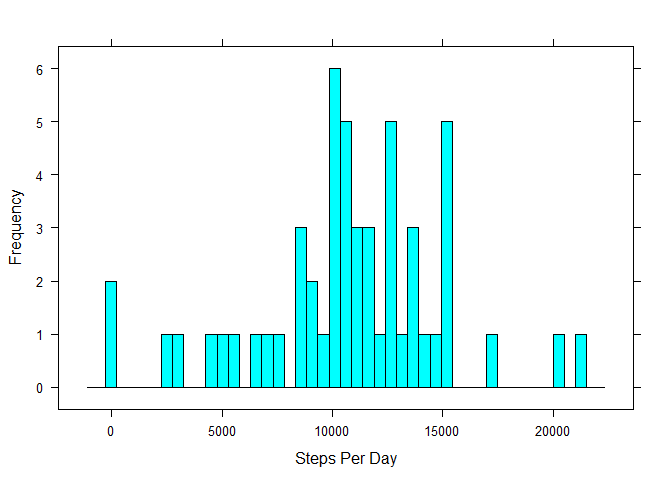
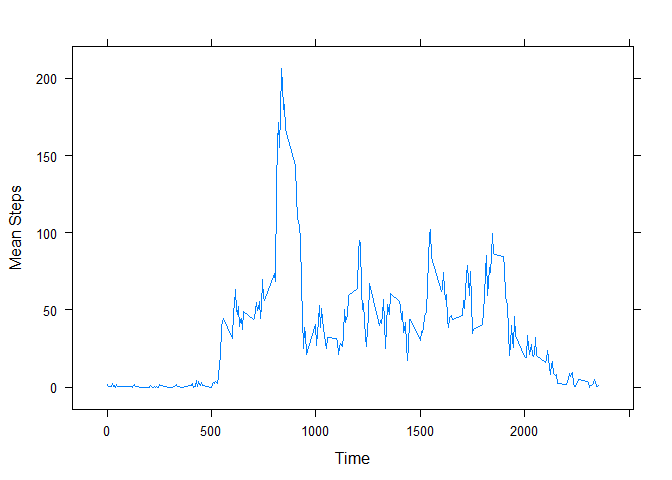
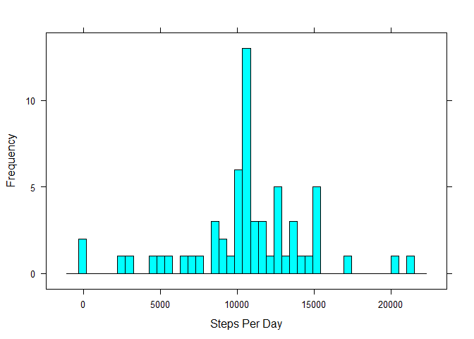

# Reproducible Research: Peer Assessment 1


## Introduction

This study makes use of data from a personal activity monitoring device. This device collects data at 5 minute intervals through out the day. The data consists of two months of data from an anonymous individual collected during the months of October and November, 2012 and include the number of steps taken in 5 minute intervals each day.

The variables included in this dataset are:

* steps: Number of steps taking in a 5-minute interval (missing values are coded as NA)

* date: The date on which the measurement was taken in YYYY-MM-DD format

* interval: Identifier for the 5-minute interval in which measurement was taken

The dataset is stored in a comma-separated-value (CSV) file and there are a total of 17,568 observations in this dataset.


## Loading and preprocessing the data

The data are already included in the repository as a zip archive.  We will first expand the archive if it has not been already and read the CSV file into a data frame, setting appropriate column classes in the process.


```r
if(!file.exists("./activity.csv") & file.exists("./activity.zip"))
{
  unzip("activity.zip", setTimes=T)
}
rawdata <- read.csv("activity.csv", colClasses=c("integer", "Date", "factor"))
```


## What is mean total number of steps taken per day?

Our first question examines the characteristics of the steps the subject took during each day of the observation period.  We first run a `tapply` call over the data set using the date column as an index to create an array containing the sum of steps for each of the 61 days in the observation period. 


```r
spd <- tapply(rawdata$steps, rawdata$date, sum)
```

Next we generate a histogram of the steps taken per day to help visualize the distribution of the values.  For this we will use the [lattice](https://cran.r-project.org/web/packages/lattice/index.html) R package.  NA values are ignored.


```r
library(lattice)
histogram(spd, type="count", nint=45, na.rm=T, xlab="Steps Per Day", ylab="Frequency")
```

 

Finally, we use the resulting data to calculate the daily mean and median of steps taken, ignoring NA values in the process. 
 

```r
meanspd <- mean(spd, na.rm=T)
medspd <- median(spd, na.rm=T)
```

The mean number of steps taken by this subject per day is 10766.19.  The median number of steps taken per day by this subject is 10765. 

The total number of steps recorded by this subject over the observation period is 570608.


## What is the average daily activity pattern?

Next we want to analyze the distribution of steps over the course of an average day.  To do this, we `split` the dataset into a list of intervals containing the steps for each corresponding interval for each day of the observation period.  We then transform the list using `sapply` to apply a `mean` function to each set of steps.  Again, we ignore NA values and also round to two decimal places with the assumption that such rounding will provide sufficient accuracy for our purposes and make the numbers more readable.


```r
intmeansteps <- sapply(split(rawdata$steps, rawdata$interval), function(x) {round(mean(x, na.rm=T), 2)})
```

Now we have a numeric vector whose column names correspond to the intervals.  We then take this vector
and convert it to a data frame with two variables: `interval`, extracted from the column names, and `meansteps`.  The conversion process mixes up the row order so we apply an `order` call to organize the data frame rows in interval order.


```r
intmeansteps2 <- data.frame(interval = as.numeric(names(intmeansteps)), meansteps = intmeansteps)
intmeansteps2 <- intmeansteps2[order(intmeansteps2[,1]),]
```

Next, we plot the time series represented by the transformed data showing the time interval in the x-axis and the mean steps taken in the y-axis.  We use the lattice `xyplot` function to produce the figure.


```r
xyplot(meansteps ~ interval, data=intmeansteps2, type="l", xlab="Time", ylab="Mean Steps")
```

 

Finally, we apply the `which` function to find the max value of mean steps and use the index to determine the time interval in which it occurs.


```r
maxmeaninterval <- names(intmeansteps[which.max(intmeansteps)])
```

The 5-minute interval, on average across all the days in the dataset, that contains the maximum number of steps for this subject is 835 which corresponds to 0835 hours in 24-hour time.


## Imputing missing values

Up until now we have been ignoring NA values for convenience, but on initial inspection there appears to be significant missing values.  We apply the `sum` function to the original data frame to get a count.


```r
numNA = sum(is.na(rawdata$steps))
```

The total number of NA values for this subject during the observation period is 2304, which accounts for 13.11% of the data set.

For the remainder of this study we wish to replace NAs with a reasonable simulation of values to make a complete data set.  We make a copy of the data frame, then loop through the data, using the daily means that we computed previously as an index to replace the NAs with the daily mean for the corresponding time interval (this is an expensive operation).


```r
simdata <- rawdata

for(i in 1:nrow(simdata))
{
  if(is.na(simdata[i,]$steps)) 
  {
    simdata[i,]$steps <- as.integer(intmeansteps2[intmeansteps2$interval == simdata[i,]$interval,]$meansteps)
  }
}
```

Next we wish to verify the statistical characteristics of the imputed data set with the original data.  We use `tapply` to calculate the `sum` of steps using date as an index.  Then we calculate the `mean` and `median` of the steps per day.


```r
simspd <- tapply(simdata$steps, simdata$date, sum)

simmeanspd <- mean(simspd)
simmedspd <- median(simspd)
```

The mean number of steps taken by this subject in the imputed data set per day is 10749.77.  The difference in means between the raw and imputed data is 0.15%.

The median number of steps taken by this subject in the imputed data set per day is 10641.  The difference in median between the raw and imputed data is 1.16%.

Now, we plot a histogram like we did previously on the original data.


```r
histogram(simspd, type="count", nint=45, xlab="Steps Per Day", ylab="Frequency")
```

 

Comparing the mean, median, and distribution of the imputed data, replacing NA values with the corresponding mean for the given time interval had no appreciable effect on the average and median number of steps taken per day. Thus, the imputed data set is statistically consistent with the recorded data set.

The total number of steps taken by this subject in the imputed data set is 655736, which is significantly more than the recorded number of steps in the original data set.  This difference accounts for the increased magnitude of the y-axis values in the imputed data set's steps per day histogram but has no effect on the distribution.


## Are there differences in activity patterns between weekdays and weekends?

For further analysis, we wish to compare the steps taken during weekdays versus those taken on weekends.  We'll use the [dplyr](https://cran.r-project.org/web/packages/dplyr/index.html) R package to create a new variable in the imputed data set that will indicate whether the observation is on a weekday or weekend.


```r
library(dplyr, warn.conflicts=F, quietly=T)
simdata <- mutate(simdata, week = factor(1 * (as.POSIXlt(date)$wday %in% c(1:5)), labels = c("weekend", "weekday")))
```

At this point, things get a little convoluted.  First, we `split` the data frame into two sets of data - one containing weekend observations and the other weekday observations.  We then apply the same `split` and `sapply` combo that we did previously when analyzing the entire data set.  The result is two data frames for the respective weekly periods.  In addition to mean steps and intervals, we add back the weekend/weekday factor as a variable to the respective data frames.


```r
tmp <- split(simdata, simdata$week)

wemeansteps <- sapply(split(tmp$weekend$steps, tmp$weekend$interval), function(x) {round(mean(x, na.rm=T), 2)})
wemeansteps2 <- data.frame(interval = as.numeric(names(wemeansteps)), meansteps = wemeansteps)
wemeansteps2 <- mutate(wemeansteps2, week = c("weekend"))
wemeansteps2 <- wemeansteps2[order(wemeansteps2[,1]),]

wdmeansteps <- sapply(split(tmp$weekday$steps, tmp$weekday$interval), function(x) {round(mean(x, na.rm=T), 2)})
wdmeansteps2 <- data.frame(interval = as.numeric(names(wdmeansteps)), meansteps = wdmeansteps)
wdmeansteps2 <- mutate(wdmeansteps2, week = c("weekday"))
wdmeansteps2 <- wdmeansteps2[order(wdmeansteps2[,1]),]
```

Next, we combine the two data frames and plot the histogram as before, but using the `week` factor as a conditioning variable to create a second panel.


```r
allsteps <- rbind(wemeansteps2, wdmeansteps2)
xyplot(meansteps ~ interval | week, data=allsteps, type="l", xlab="Time", ylab="Mean Steps", layout=c(1,2))
```

 

Thus, we can see the differences in the average steps taken between weekdays and weekends.  Weekend activity is clearly better distributed across waking hours than on weekdays, where most activity is right before and after work hours with a slight increase around lunch.


